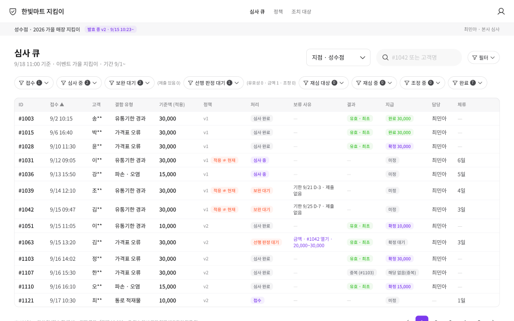
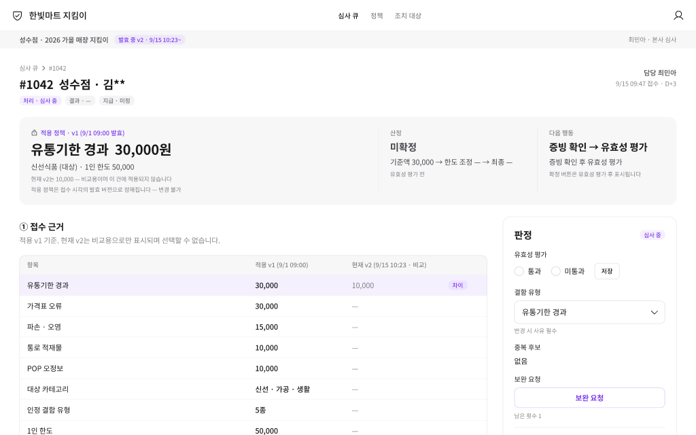
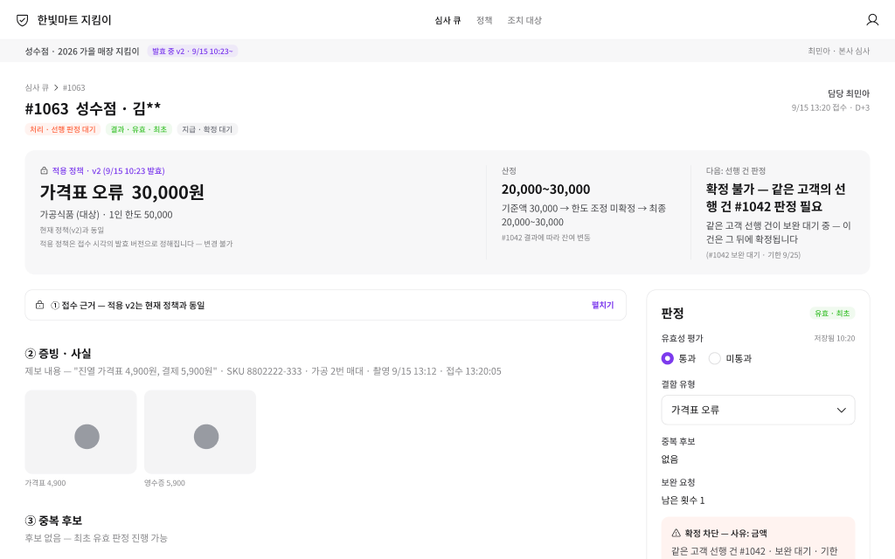
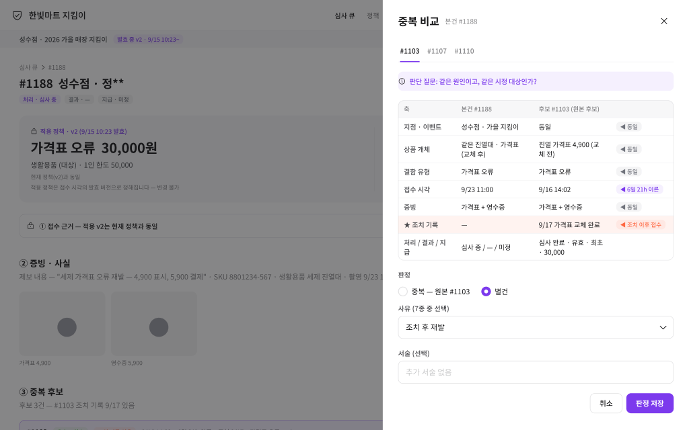
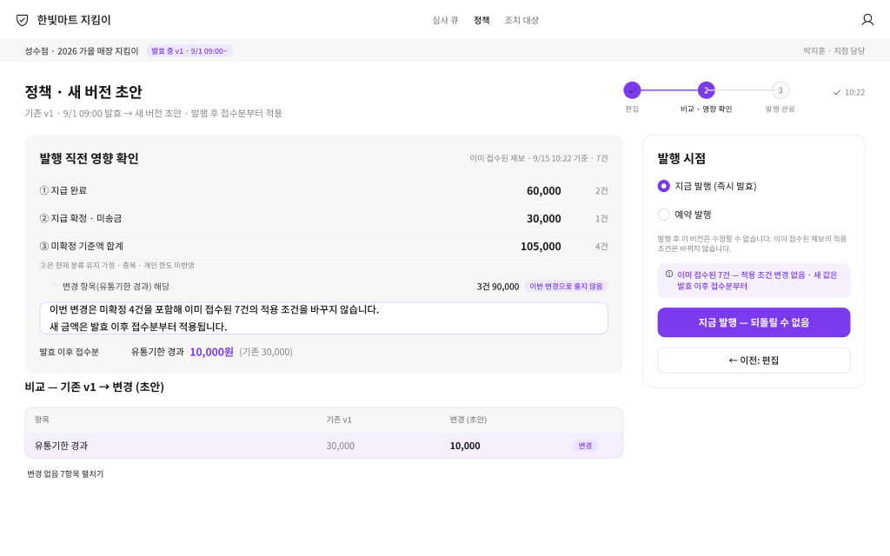

# 한빛마트 매장 지킴이 — 심사 정책 관리·적용 콘솔

제보를 심사하는 동안 리워드 정책이 바뀌어도, 고객이 제출할 때 본 조건 그대로 심사되게 만드는 관리자 백오피스입니다. 프로덕트 디자이너 채용 사전 과제로 2026년 9월 14일부터 18일까지 닷새간 작업했습니다.

**여기서 한 번에 봅니다** — [사이트 열기](https://hs2190.github.io/hanbit-guardian-review-console/) · 개요 · 화면 10장 · 문서 14편 · 동작하는 프로토타입
**설계 정본은 Figma입니다** — [파일 열기](https://www.figma.com/design/riBWYMkoDYOWaRlTkggqnK/) · 토큰 · 컴포넌트 · 전 화면 33장
**선택한 트랙** — 관리자 백오피스 (고객 화면은 접점 3개만 정의)

| | |
|---|---|
|  |  |
| 심사 큐 — 처리·결과·지급 세 축을 열로 분리 | 심사 상세 — 접수 당시 정책이 잠긴 채 근거부터 |

## 문제

정책은 이벤트 도중에 바뀌고, 제출과 지급 사이에는 수일에서 수주가 걸립니다. 그 사이에 금액이 내려가면 고객은 제출할 때 본 것과 다른 돈을 받습니다. 심사자는 이 제보가 어느 시점 기준인지 확인할 방법이 마땅치 않아 지금 값으로 판단합니다.

겉으로는 금액 분쟁이지만, 실제로는 **하나의 제보에 두 개의 기준이 존재할 수 있다는 것**이 문제입니다. 기준이 둘이면 누가 성실하게 일해도 결과가 갈립니다.

## 한 수

> **적용 정책은 접수 시각의 발효 버전으로 정해지고, 심사자는 그것을 선택할 수 없다.**

심사자에게 판단 재량을 더 주는 대신, 고를 수 있다는 것 자체를 없앴습니다. 오류의 원인이 부주의가 아니라 선택지의 존재라고 봤기 때문입니다.

여기서 네 가지가 따라 나옵니다.

- **상태를 세 축으로 쪼갰습니다.** 처리와 결과와 지급이 한 배지에 섞여 있으면 "유효한데 한도 때문에 0원"이 반려로 읽힙니다.
- **판정 순서를 다섯 단계로 고정했습니다.** 범위, 유효성, 중복, 최초 여부, 한도 순서입니다. 순서가 흔들리면 같은 사건이 다른 결과를 냅니다.
- **같은 고객의 선행 건이 미판정이면 확정을 막습니다.** 처리 순서에 따라 총액이 달라지는 것을 막기 위해 접수순으로 배정합니다. 대가는 대기이고, 그 대기를 화면에 드러냅니다.
- **정책을 바꾸기 전에 영향을 먼저 봅니다.** 이미 접수된 건이 몇 건이고 그중 얼마가 이번 변경으로 줄지 않는지를 숫자로 보여준 다음에 발행 버튼이 열립니다.

## 화면

| | | |
|---|---|---|
|  |  |  |
| 확정 차단 — 이유와 다음 행동을 함께 | 중복 비교 — 판단 질문과 여섯 비교 축 | 영향 확인 — 발행 전 마지막 게이트 |

이 외에 유효·0원, 완료, 정책 현황, 빈 상태, 에러 화면이 저장소의 [assets/screens](assets/screens)에 있습니다.

## 문서

읽는 문서는 여섯 편입니다. 과제가 요구한 세 답변과 필수 항목을 담았습니다.

| 문서 | 내용 |
|---|---|
| [01 트랙 선택과 범위](docs/01-track.md) | 왜 관리자 화면인가, 고객 화면 접점 3개 |
| [02 문제와 근거](docs/02-problem.md) | 기준과 수단의 불일치, 숨은 문제 3, 공개 사례 5 |
| [03 규칙과 버린 대안](docs/03-rules.md) | 단일 원칙, 판정 순서 5단계, 버린 대안 3 |
| [04 상태 모델과 정책 적용](docs/04-states.md) | 3축 상태와 전이, 정책 변경이 각 상태에 미치는 영향 |
| [05 화면 결정](docs/05-screens.md) | 의미 제약 5의 번역, 의도적으로 하지 않은 것 |
| [06 검수 기록](docs/06-review.md) | 잡힌 결함 4, 받아들이지 않은 지적 |

부록 네 편은 위 여섯 편의 근거입니다. 작업 원문을 그대로 옮긴 것이 아니라, 주장을 뒷받침하는 내용만 다시 썼습니다. [상태와 전이](docs/appendix/states.md) · [무엇을 확인하면 되는가](docs/appendix/requirements.md) · [문구 규칙과 대조 예](docs/appendix/copy.md) · [디자인 시스템 적용](docs/appendix/design-system.md).

## 과정과 도구

문서를 먼저 고정하고 화면을 그렸습니다. 규칙과 상태와 문구가 정본으로 확정돼 있으면 화면은 조합 문제가 됩니다. 실제로 디자인 시스템을 바꿔 서른세 장을 다시 그릴 때도 로직은 건드릴 필요가 없었습니다.

검수와 교차검증에는 직접 구축한 멀티에이전트 체계를 사용했습니다. 무엇을 만들지, 지적을 받아들일지, 어떻게 고칠지는 제가 정했습니다. 자세한 내용은 [13번 문서](docs/13-review.md)에 있습니다.

디자인 시스템은 개인 프로젝트인 Iris를 라이브러리로 연결해 썼습니다. 이 과제 파일에는 자체 토큰을 두지 않았고, 사용한 변수 96개와 컴포넌트 25종을 Figma 안에 정리해 두었습니다.

## 한계

- **사용자 검증을 하지 못했습니다.** 적용 정책을 고를 수 없게 만든 것이 심사자에게 방해가 아니라 안심으로 느껴지는지가 첫 검증 항목입니다.
- **보완 요청 1회와 기한 7일은 가설입니다.** 운영 데이터로 정할 값입니다.
- **동시 편집 잠금 UI가 없습니다.** 먼저 확정한 쪽이 이기고 뒤늦은 저장은 실패 안내를 받습니다.

## 프로토타입에서 직접 눌러 볼 것

[여기서 열립니다.](https://hs2190.github.io/hanbit-guardian-review-console/) 목 데이터로 브라우저 안에서만 돌고 서버가 없어, 새로고침하면 처음 상태로 돌아갑니다.

- **접수 시각이 기준이라는 것** — `#1042`는 9월 15일 9시 47분 접수라 v1의 30,000원이 적용됩니다. 36분 뒤 v2가 발효했지만 이 건은 바뀌지 않습니다. 같은 화면의 `#1051`은 발효 뒤 접수라 10,000원입니다.
- **선행 건이 막는다는 것** — [`#1063`](https://hs2190.github.io/hanbit-guardian-review-console/?id=1063)은 같은 고객의 선행 건 `#1042`가 미판정이라 확정이 막혀 있습니다. `#1042`를 확정하면 `#1063`이 잔여 한도로 열립니다.
- **유효한데 0원** — 한도를 다 쓴 고객의 새 제보는 결과가 유효로 남고 지급만 해당 없음이 됩니다. 반려가 아닙니다.
- **조치 후 재발은 별건** — `#1188`은 `#1103`과 같은 상품·같은 결함이지만 조치 완료 뒤의 재발이라 중복이 아닙니다.
- **발행 전 영향 확인** — [정책 화면](https://hs2190.github.io/hanbit-guardian-review-console/?tab=policy)에서 금액을 바꾸면 이미 접수된 건이 몇 건이고 얼마가 줄지 않는지가 먼저 계산됩니다.

규칙은 [테스트 13개](app/src/domain/rules.test.ts)로 검증합니다. `cd app && npm install && npm test`.

---

과제 원문의 권리는 출제사에 있어 이 저장소에 싣지 않았습니다. 문서와 화면은 제가 작성한 것입니다.
